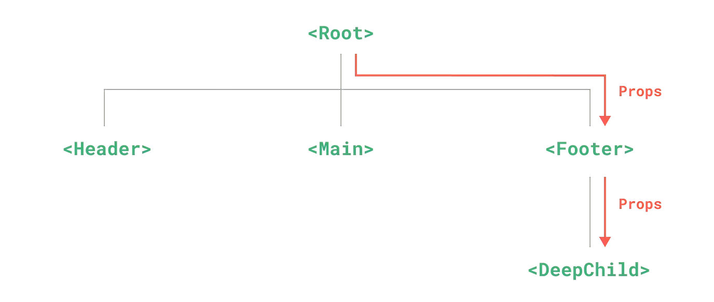
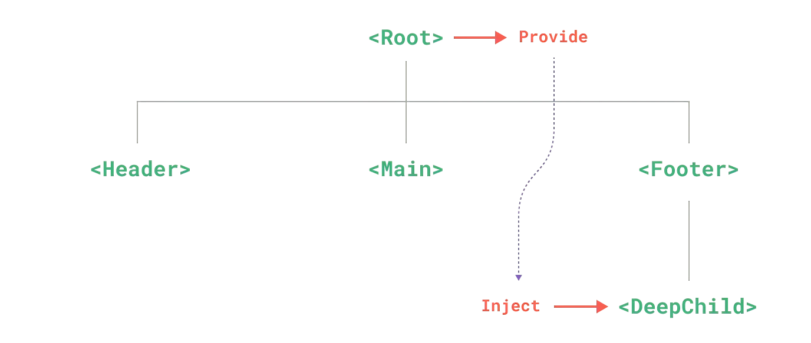

>通常情况下，当我们需要从父组件向子组件传递数据时，会使用 props。想象一下这样的结构：有一些多层级嵌套的组件，形成了一颗巨大的组件树，而某个深层的子组件需要一个较远的祖先组件中的部分数据。在这种情况下，如果仅使用 props 则必须将其沿着组件链逐级传递下去，这会非常麻烦。如果组件继承链路特别长，就会导致中间组件的大规模改写。本篇文章介绍Vue中的依赖注入。

## Props 逐级透传问题
如果采取逐级透传，修改每个组件  

如果使用依赖注入，只关注需要传递数据的两个组件  


## 语法介绍
首先，我们需要在父组件中显式地指定需要导出的数据
```ts
export default {
  provide: {
    message: 'hello!'
  }
}
```
然后在子组件中指定需要注入的数据 (数据直接被注入到this上)
```ts
export default {
  inject: ['message'],
  created() {
    console.log(this.message) // injected value
  }
}
```
而inject部分可以十分灵活  
指定别名
```ts
export default {
  inject: {
    localMessage: {
      from: 'message'
    }
  }
}
```
设定默认值
```ts
export default {
  inject: {
    localMessage: {
      from: 'message',
      default: 'hello world!'
    }
  }
}
```
值得注意的是，inject是从下自上的，所以如果有多个同名的provide，最靠近子组件的provide会被采用。

## 与响应式结合
以上提到的inject都是在组件初始化的时候被赋值，之后就不会更新。如果需要同步更新，要使用上篇文章提到的Ref。
在父组件中
```ts
import { computed } from 'vue'

export default {
  data() {
    return {
      message: 'hello!'
    }
  },
  provide() {
    return {
      // 显式提供一个计算属性
      message: computed(() => this.message)
    }
  }
}
```
computed返回Ref类型，并监听了`this.message`  
所以当我们更新`this.message`时，子组件中inject的也会同样更新。  
（其实Ref可以理解为一个指针，而且会在指向的value发生更新时emit更新事件提示computed函数更新）

## 简单应用
```ts
// 父组件
<template>
  <h2>Parent Component</h2>
  <child-component></child-component>
</template>
<script setup>
  export default {
    data() {
      return {
        msg: "Hello World!"
      };
    },
    provide() {
      return {
        message: computed(() => this.msg),
        showMessage: () => alert(this.msg),
        changeMessage: () => this.msg = 'message changed'
      };
    }
  }
</script>

// 子组件
<template>
  <h3>Child Component</h3>
  <p>{{ message }}</p>
  <button @click="showMessage">Show Message</button>
  <button @click="changeMessage">Change Message</button>
</template>
<script setup>
  export default {
    inject: ["message", "showMessage", "changeMessage"]
  }
</script>
```
